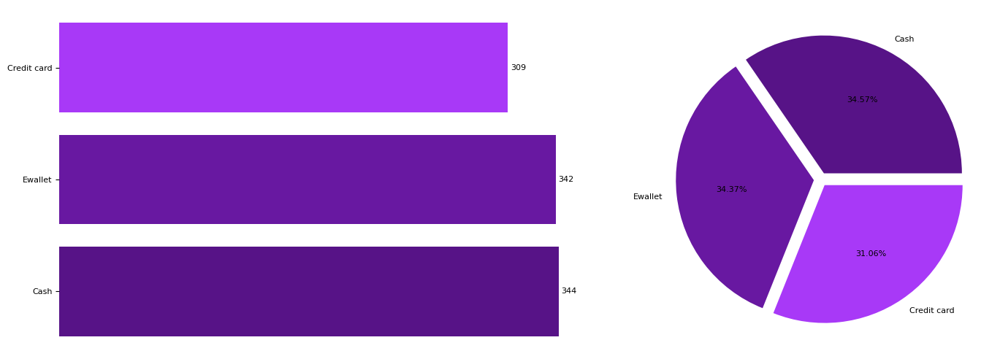
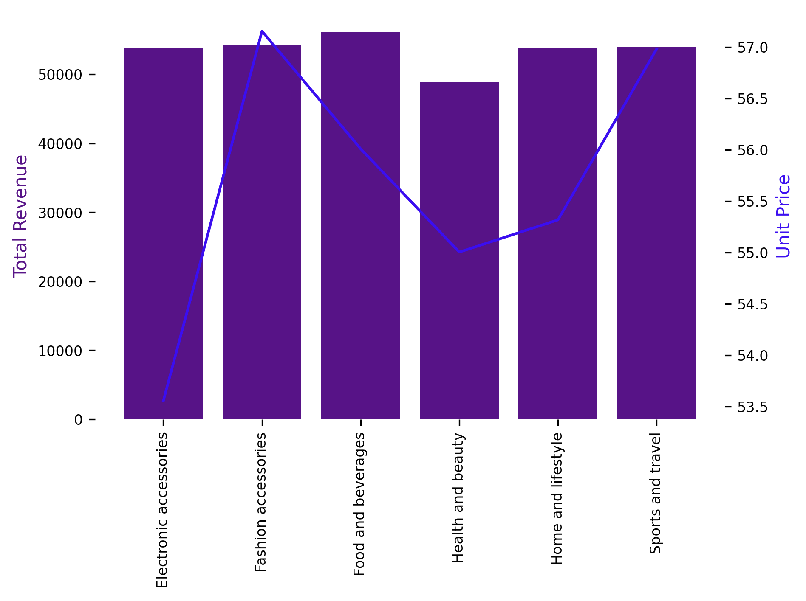

# Walmart-Sales-Analysis

I undertook a project focused on analyzing **Walmart** Sales data using **MySQL**. The project aimed to gain insights into the top-performing branches and products, observe sales trends across various product categories, and **understand customer behavior**. The primary objective was to explore opportunities for **enhancing and optimizing sales strategies** within the retail environment. The dataset was obtained from the [Walmart Recruiting - Store Sales Forecasting](https://www.kaggle.com/c/walmart-recruiting-store-sales-forecasting)

### About Data
This dataset contains sales transactions from a three different branches of **Walmart**, respectively located in Mandalay, Yangon and Naypyitaw. The data contains 17 columns and 1000 rows

| Column Name             | Data Type              | Null | Primary Key |
|-------------------------|------------------------|------|-------------|
| invoice_id              | VARCHAR(30)            | No   | Yes         |
| branch                  | VARCHAR(5)             | No   | No          |
| city                    | VARCHAR(30)            | No   | No          |
| customer_type           | VARCHAR(30)            | No   | No          |
| gender                  | VARCHAR(10)            | No   | No          |
| product_line            | VARCHAR(100)           | No   | No          |
| unit_price              | DECIMAL(10, 2)         | No   | No          |
| quantity                | INT                    | No   | No          |
| VAT                     | FLOAT(6, 4)            | No   | No          |
| total                   | DECIMAL(10, 2)         | No   | No          |
| date                    | DATE                   | No   | No          |
| time                    | TIME                   | No   | No          |
| payment_method          | VARCHAR(15)            | No   | No          |
| cogs                    | DECIMAL(10, 2)         | No   | No          |
| gross_margin_percentage | FLOAT(11, 9)           | No   | No          |
| gross_income            | DECIMAL(12, 4)         | No   | No          |
| rating                  | FLOAT(2, 1)            | No   | No          |

### Business Questions To Answer

##### Generic Questions:
1. How many unique cities does the data have? ✅
2. In which city is each branch? ✅

##### Product Questions:
3. How many unique product lines does the data have? ✅
4. What is the most common payment method? ✅
5. What is the most selling product line? ✅
6. What is the total revenue by month? ✅
7. What month had the largest COGS? ✅
8. What product line had the largest revenue? ✅
9. What is the city with the largest revenue? ✅
10. What product line had the largest VAT? ✅
11. For each product line, add a column showing "Good" or "Bad" based on whether its sales are greater than average. ✅
12. Which branch sold more products than the average number of products sold? ✅
13. What is the most common product line by gender? ✅
14. What is the average rating of each product line? ✅

##### Sales Questions:
15. Number of sales made in each time of the day per weekday. ✅
16. Which customer type brings the most revenue? ✅
17. Which city has the largest tax percent/VAT (Value Added Tax)? ✅
18. Which customer type pays the most in VAT? ✅

##### Customer Questions:
19. How many unique customer types does the data have? ✅
20. How many unique payment methods does the data have? ✅
21. What is the most common customer type? ✅
22. Which customer type buys the most? ✅
23. What is the gender of most customers? ✅
24. What is the gender distribution per branch? ✅
25. During which time of the day do customers give the most ratings? ✅
26. During which time of the day do customers give the most ratings per branch? ✅
27. Which day of the week has the best average ratings? ✅
28. Which day of the week has the best average ratings per branch? ✅

### Data Visualization

